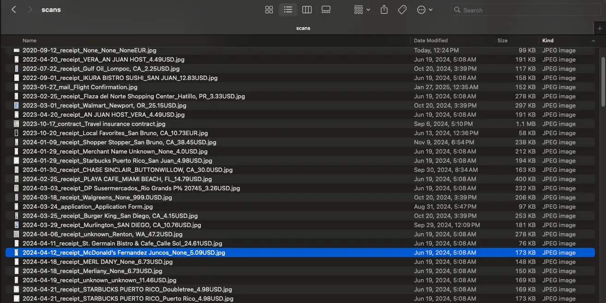

## tl;dr

This is automation tool to organize scanned docs. It get's the merchant, amount paid, date from the scanned docs and receipts and rename files appropriately 


After


# long story

We all know the frustration of managing a flood of scanned documents on our phones—receipts, bills, letters, and random paperwork piling up into a digital mess. Finding what you need when you need it? A nightmare.

To solve this, I built a tool that combines two powerful technologies: Tesseract OCR and GPT-4. Here's how it works:

1️⃣ Tesseract OCR extracts text from mobile document scans, turning images into readable data.
2️⃣ GPT-4 LLM then classifies and organizes this data intelligently—identifying whether it’s a receipt, a bill, or a letter, and even suggesting appropriate folders or tags.

The result? A seamless process where your scanned documents are not only digitized but also categorized, searchable, and ready for future use.

This project is still evolving, but seeing how much time and effort it saves already feels rewarding. From decluttering my digital life to helping others stay organized, I’m excited about the potential impact.

What’s the most frustrating part of managing your digital documents? I’d love to hear your thoughts!

## quick start

```shell
pip install git+https://github.com/dzianisv/ScansOrganizer.git
doc-organizer <path_to_image>
```


## PDF support

Requires `poppler` to be installed.

```shell
brew install poppler
````